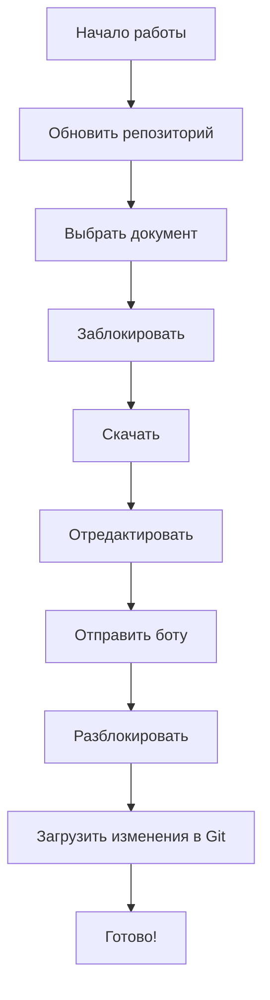

# ⚡ Быстрая справка по Git Docs Bot

## 🎯 За 1 минуту

### Первая настройка
```
/start → ℹ️ О репозитории → ⚙️ Настроить репозиторий
→ Введите URL → Введите логин → Введите токен
```

### Работа с документом
```
📂 Документы → Выбрать документ → 🔒 Заблокировать
→ 📥 Скачать → Отредактировать → Отправить боту
→ 🔓 Разблокировать
```

---

## 📋 Основные команды

| Действие | Кнопка |
|----------|--------|
| Посмотреть документы | `📂 Документы` |
| Заблокировать документ | `🔒 Заблокировать` |
| Разблокировать документ | `🔓 Разблокировать` |
| Скачать документ | `📥 Скачать` |
| Обновить из Git | `🔧 Git операции` → `🔄 Обновить` |
| Загрузить в Git | `🔧 Git операции` → `⬆️ Загрузить` |
| Проверить статус | `🔧 Git операции` → `🧾 Git статус` |
| Инфо о репозитории | `ℹ️ О репозитории` |
| Справка | `📖 Инструкции` |

---

## 🔑 Создать токен GitHub

**Путь:** GitHub → Settings → Developer settings → Personal access tokens → Tokens (classic)

**Права:** ✅ repo (все подпункты)

**Важно:** Скопируйте токен сразу - он показывается только один раз!

---

## ⚠️ Золотые правила

1. ✅ **Всегда блокируйте** документ перед работой
2. ✅ **Всегда разблокируйте** после завершения
3. ✅ **Обновляйте репозиторий** перед началом работы
4. ✅ **Загружайте изменения** после работы
5. ❌ **Не передавайте** токен другим людям

---

## 🆘 Экстренная помощь

| Проблема | Решение |
|----------|---------|
| Документ заблокирован другим | Подождите или свяжитесь с владельцем |
| Нет доступа к репозиторию | Проверьте токен и права |
| Файл не загружается | Убедитесь, что формат `.docx` |
| Токен не работает | Создайте новый токен |

---

## 🔄 Рекомендуемый процесс работы



**Краткая версия:**
```
🔄 Обновить → 📂 Документы → 🔒 Заблокировать
→ 📥 Скачать → ✏️ Редактировать → 📤 Отправить
→ 🔓 Разблокировать → ⬆️ Загрузить
```

---

## 💡 Подсказки

- Бот работает с **GitHub** и **GitLab**
- Поддерживает только файлы **`.docx`**
- Блокировка использует **Git LFS**
- Один пользователь = один репозиторий
- Токен хранится безопасно на сервере бота

---

📖 **Полная инструкция:** [USER_GUIDE.md](USER_GUIDE.md)
