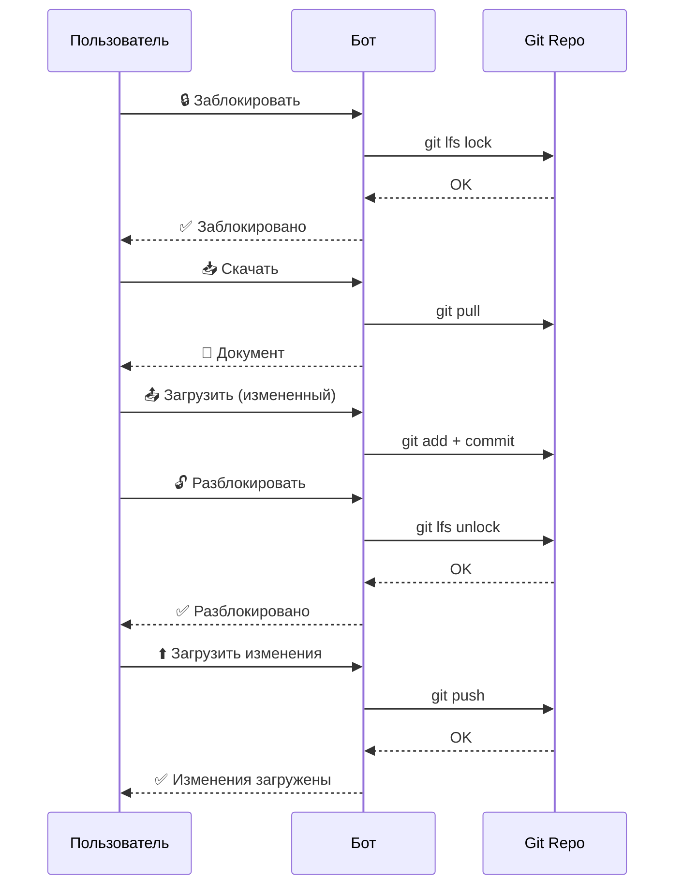

# 🤖 Git Docs Bot - Система управления документами через Telegram

Telegram-бот для совместной работы с документами Word (.docx) через Git репозиторий.

## 🌟 Основные возможности

- ✅ **Работа с GitHub и GitLab** - автоматическое определение типа репозитория
- ✅ **Блокировка документов** - предотвращение конфликтов при одновременной работе (Git LFS)
- ✅ **Скачивание и загрузка** - работа с документами прямо из Telegram
- ✅ **Git интеграция** - полная синхронизация с удаленным репозиторием
- ✅ **Безопасность** - токены и SSH ключи хранятся надежно
- ✅ **Многопользовательский режим** - каждый пользователь работает со своим репозиторием

## 📚 Документация

- 📖 [**Полная инструкция**](USER_GUIDE.md) - подробное руководство по всем функциям
- ⚡ [**Быстрый старт**](QUICK_START.md) - краткая справка и шпаргалка

## 🚀 Быстрый старт

### 1. Запустите бота
```
/start
```

### 2. Настройте репозиторий
```
ℹ️ О репозитории → ⚙️ Настроить репозиторий
```

Вам понадобится:
- URL репозитория (GitHub/GitLab)
- Логин (username)
- Personal Access Token (для GitHub) или SSH ключ (для GitLab)

### 3. Начните работу
```
📂 Документы → Выберите файл → 🔒 Заблокировать → 📥 Скачать
```

## 🎯 Типичные сценарии использования

### Редактирование документа
```
1. 📂 Документы - открыть список
2. Выбрать документ
3. 🔒 Заблокировать - заблокировать для других
4. 📥 Скачать - скачать на устройство
5. ✏️ Отредактировать
6. 📤 Отправить файл боту - загрузить обратно
7. 🔓 Разблокировать - освободить для других
```

### Синхронизация изменений
```
1. 🔧 Git операции
2. 🔄 Обновить репозиторий - получить изменения других
3. ⬆️ Загрузить изменения - отправить свои изменения
```

### Проверка статуса
```
1. 🔧 Git операции → 🧾 Git статус
   Или
2. ℹ️ О репозитории - общая информация
```

## 🔐 Безопасность

- Токены хранятся в зашифрованном виде
- SSH ключи генерируются индивидуально для каждого пользователя
- Репозитории изолированы друг от друга
- Логирование всех операций

## ⚙️ Поддерживаемые платформы

| Платформа | Аутентификация | Git LFS | Статус |
|-----------|---------------|---------|--------|
| GitHub | Personal Access Token | ✅ | Полная поддержка |
| GitLab | SSH ключи | ✅ | Полная поддержка |
| GitLab (self-hosted) | SSH ключи | ✅ | Полная поддержка |

## 📋 Основное меню

```
🤖 Git Docs Bot
├── 📂 Документы
│   ├── Просмотр списка .docx файлов
│   ├── Скачивание документов
│   ├── Загрузка документов
│   └── Управление блокировками
├── 🔧 Git операции
│   ├── 🔄 Обновить репозиторий
│   ├── ⬆️ Загрузить изменения
│   └── 🧾 Git статус
├── 🔒 Блокировки (админ)
│   ├── Просмотр всех блокировок
│   └── Принудительное снятие блокировок
├── ℹ️ О репозитории
│   ├── Информация о репозитории
│   └── ⚙️ Настроить репозиторий
├── ⚙️ Настройки (админ)
│   └── Управление пользователями
└── 📖 Инструкции
    └── Встроенная справка
```

## 🛠️ Требования

### Для пользователей
- Telegram аккаунт
- Репозиторий на GitHub или GitLab
- Personal Access Token (GitHub) или доступ для добавления SSH ключа (GitLab)

### Для сервера
- Python 3.8+
- Git 2.0+
- Git LFS
- python-telegram-bot
- См. [requirements.txt](requirements.txt)

## 📖 Подробная документация

### Руководства
- [USER_GUIDE.md](USER_GUIDE.md) - Полная инструкция пользователя
- [QUICK_START.md](QUICK_START.md) - Быстрая справка

### Встроенная справка
Нажмите **📖 Инструкции** в боте для получения справки прямо в Telegram.

## ❓ Частые вопросы

**Q: Можно ли использовать с приватными репозиториями?**
A: Да, бот поддерживает приватные репозитории через токены и SSH ключи.

**Q: Сколько пользователей могут работать одновременно?**
A: Неограниченно, каждый пользователь работает со своим репозиторием.

**Q: Что если два человека редактируют один документ?**
A: Используйте блокировки (🔒) - они предотвращают одновременное редактирование.

**Q: Поддерживаются другие форматы кроме .docx?**
A: В текущей версии только .docx, но планируется расширение.

**Q: Как часто нужно обновлять репозиторий?**
A: Перед началом работы и после завершения - для получения последних изменений.

## 🔄 Workflow



## 🚨 Решение проблем

### Ошибка доступа к репозиторию
1. Проверьте токен/SSH ключ
2. Убедитесь в правах доступа к репозиторию
3. Проверьте URL репозитория

### Документ заблокирован
1. Проверьте владельца блокировки
2. Свяжитесь с владельцем
3. Админ может снять блокировку принудительно

### Конфликт при загрузке
1. Обновите репозиторий (🔄)
2. Проверьте статус (🧾)
3. Повторите операцию

## 📝 Лицензия

Проект разработан для внутреннего использования.

## 📞 Поддержка

При возникновении проблем обращайтесь к администратору бота.

---

**Версия:** 1.0
**Дата обновления:** 2026-01-27

